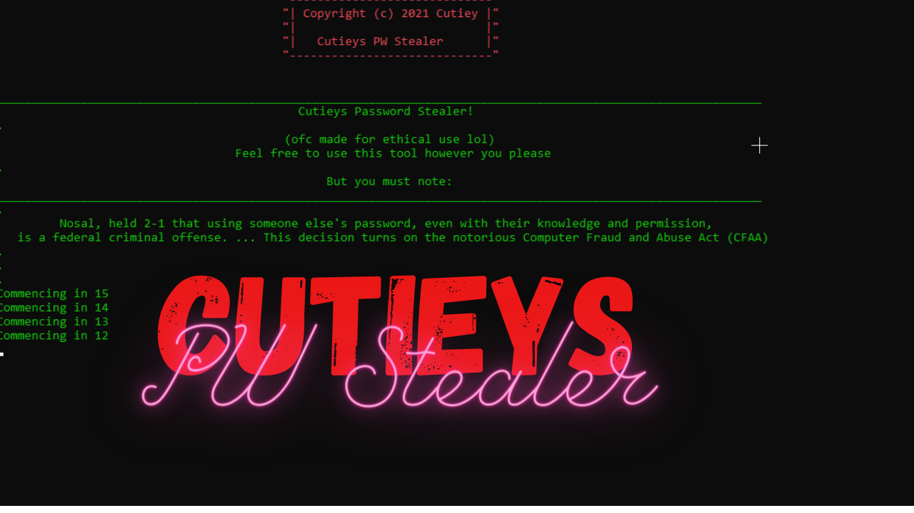

<div id="top"></div>


<!-- PROJECT LOGO -->
<br />
<div align="center">
  <a href="https://github.com/Svxy/Cutieys-Password-Stealer/blob/main/preview">
    
  </a>

<h3 align="center">Cutieys Password Stealer</h3>

  <p align="center">
    <br />
    <a href="https://youtu.be/sk5g7eBekvI"><strong>Watch the preview video! »</strong></a>
    <br />
    <br />
  </p>
</div>


<!-- TABLE OF CONTENTS -->
<details>
  <summary>Table of Contents</summary>
  <ol>
    <li>
      <a href="#about-the-project">About The Project</a>
      <ul>
        <li><a href="#built-with">Built With</a></li>
      </ul>
    </li>
    <li>
      <a href="#getting-started">Getting Started</a>
      <ul>
        <li><a href="#prerequisites">Prerequisites</a></li>
        <li><a href="#installation">Installation</a></li>
      </ul>
    </li>
    <li><a href="#contact">Contact</a></li>
    <li><a href="#acknowledgments">Acknowledgments</a></li>
  </ol>
</details>


<!-- ABOUT THE PROJECT -->
## About The Project

Cutieys PW Stealer uses an SQlite data base through an AWS VPC and grabs user logins accross several platforms with just a username, and apprehends said login(s) via Oauth2 token associated with the username

Enjoy!!

<p align="right">(<a href="#top">back to top</a>)</p>


### Built With

* [AmazonAWS](https://aws.amazon.com/?nc2=h_lg)
* [SQlite](https://www.sqlite.org/index.html)
* [VS Code](https://code.visualstudio.com/)
* [VS Community](https://visualstudio.microsoft.com/)

<p align="right">(<a href="#top">back to top</a>)</p>


<!-- GETTING STARTED -->
## Getting Started


### Prerequisites

How to download via Npm:
  ```sh
  npm install npm@latest -g
  ```

### Installation

1. (Not required) Get a free API Key at [AWS](https://aws.amazon.com/?nc2=h_lg)
2. Change directory to Desktop
   ```sh
   cd c:\users\%username%\desktop
   ```
4. Clone the repo
   ```sh
   git clone https://github.com/Svxy/Cutieys-Password-Stealer.git
   ```
4. Install NPM packages
   ```sh
   npm install
   ```

<p align="right">(<a href="#top">back to top</a>)</p>


<!-- CONTACT -->
## Contact

Cutiey - [@poopypantleg](https://twitter.com/poopypantleg) - aidan61605@gmail.com

Project Link: [https://github.com/Svxy/Cutieys-Password-Stealer](https://github.com/Svxy/Cutieys-Password-Stealer)

<p align="right">(<a href="#top">back to top</a>)</p>


<!-- ACKNOWLEDGMENTS -->
## Acknowledgments

* [Computer Fraud and Abuse Act (CFAA)](https://en.wikipedia.org/wiki/Computer_Fraud_and_Abuse_Act)
* [The Stored Communications Act (SCA)](https://en.wikipedia.org/wiki/Stored_Communications_Act)
* [The Electronic Communications Privacy Act (ECPA)](https://en.wikipedia.org/wiki/Electronic_Communications_Privacy_Act)

<p align="right">(<a href="#top">back to top</a>)</p>
